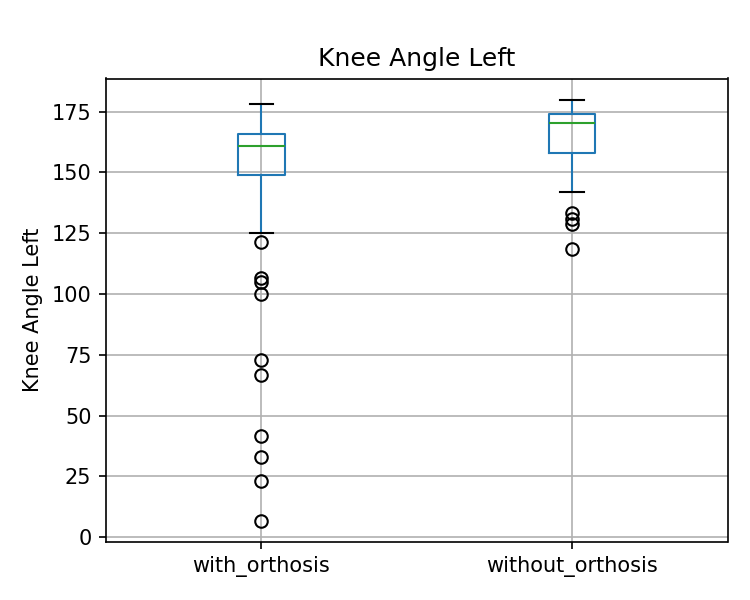
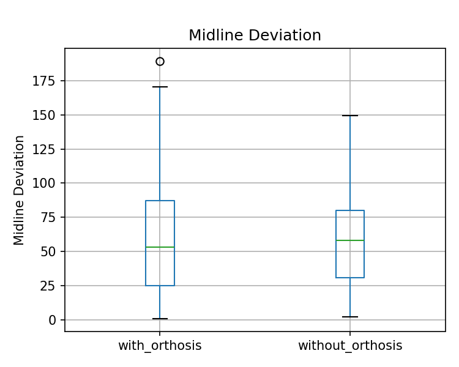

# Knee Orthosis Gait Analysis

Computer vision and gait analysis for an adjustable knee orthosis using MediaPipe Pose.

The project combines a 3D-printed knee orthosis with video-based gait measurements to compare movement with and without the device.

<p align="center">
  
  &nbsp;
  
</p>

## Tech stack

`Python` · `OpenCV` · `MediaPipe Pose` · `NumPy` · `pandas` · `Matplotlib` · `Fusion 360`

## What it does

The gait-analysis pipeline tracks the hip, knee, and ankle landmarks in each video frame and extracts:

- left and right knee angles
- midline deviation
- frame-by-frame gait measurements

The measurements are saved as CSV files and used to generate boxplots and time-series plots for the two recording conditions.

## Gait analysis

MediaPipe Pose is used for landmark detection, while OpenCV handles the video pipeline.

<p align="center">
  
</p>

The comparison is frame-based and was used as a small biomechanical analysis of the prototype rather than a clinical validation.

## Orthosis

The adjustable knee orthosis was modeled in Fusion 360 and fabricated as part of a rehabilitation engineering project.

The CAD model is available in:

```text
cad/knee_orthosis.f3d
````

## Results

Example outputs are stored in `results/figures/`.

| Knee angle                                                  | Midline deviation                                               |
| ----------------------------------------------------------- | --------------------------------------------------------------- |
|  |  |

The extracted measurements are stored in:

```text
results/metrics/
├── gait_metrics.csv
└── summary_stats.csv
```

## Repository structure

```text
cad/
└── knee_orthosis.f3d

data/
└── videos/              # local videos (not included)

docs/
└── images/

results/
├── figures/
└── metrics/

src/
├── annotate_video.py
├── analyze_results.py
├── extract_gait_metrics.py
├── pose_utils.py
└── __init__.py
```

## Run

Install the dependencies:

```bash
pip install -r requirements.txt
```

Place the two videos in:

```text
data/videos/
├── with_orthosis.mp4
└── without_orthosis.mp4
```

Extract gait metrics:

```bash
python -m src.extract_gait_metrics
```

Generate the plots:

```bash
python -m src.analyze_results
```

Annotate a video with knee landmarks and angles:

```bash
python -m src.annotate_video data/videos/with_orthosis.mp4 annotated.mp4
```
