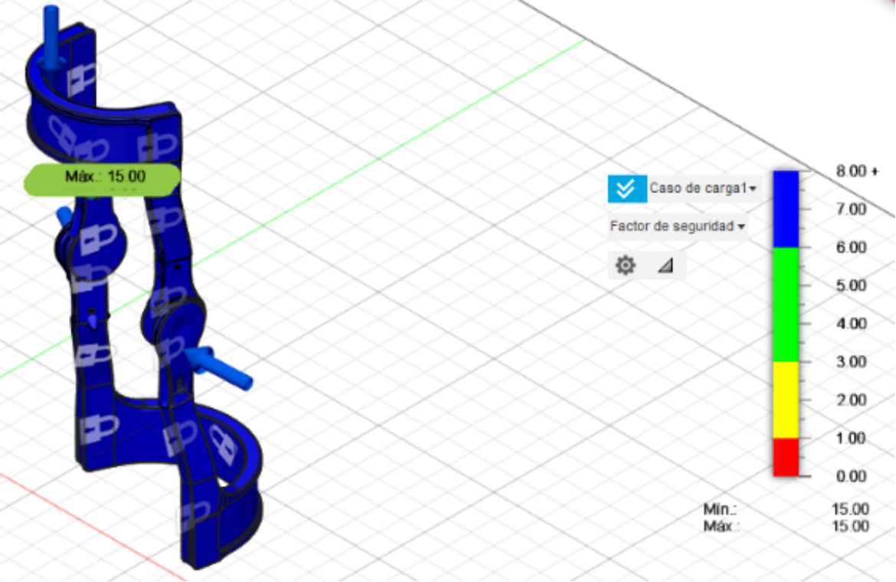

# Knee Orthosis Gait Analysis

Computer vision and gait analysis for an adjustable knee orthosis.

<p align="center">
  
</p>

## Tech stack

`Python` · `OpenCV` · `MediaPipe Pose` · `NumPy` · `pandas` · `Matplotlib` · `Fusion 360`

## Overview

The pipeline tracks hip, knee, and ankle landmarks from gait videos and extracts:

- left and right knee angles
- midline deviation
- frame-by-frame gait measurements

Results are saved as CSV files and plots for recordings with and without the orthosis.

## Run

```bash
pip install -r requirements.txt
````

Place the videos in:

```text
data/videos/
├── with_orthosis.mp4
└── without_orthosis.mp4
```

Extract metrics:

```bash
python -m src.extract_gait_metrics
```

Generate plots:

```bash
python -m src.analyze_results
```

Annotate a video:

```bash
python -m src.annotate_video data/videos/with_orthosis.mp4 annotated.mp4
```

## Project structure

```text
cad/
results/
src/
```
